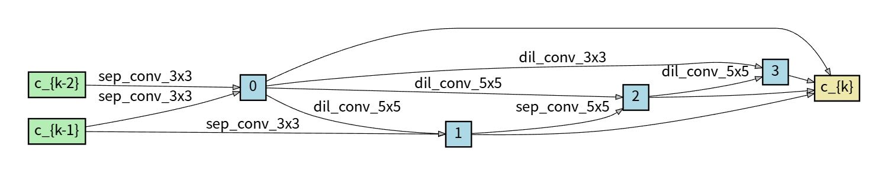
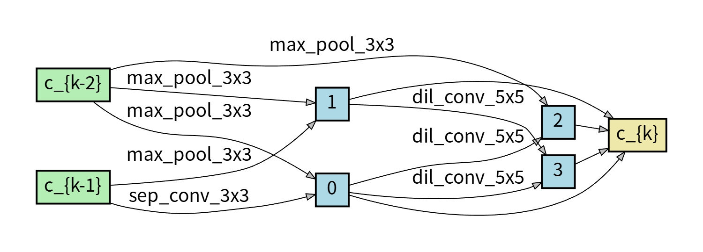
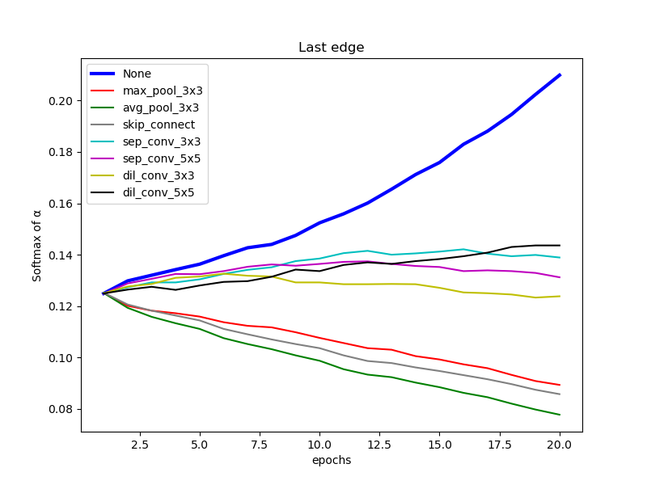
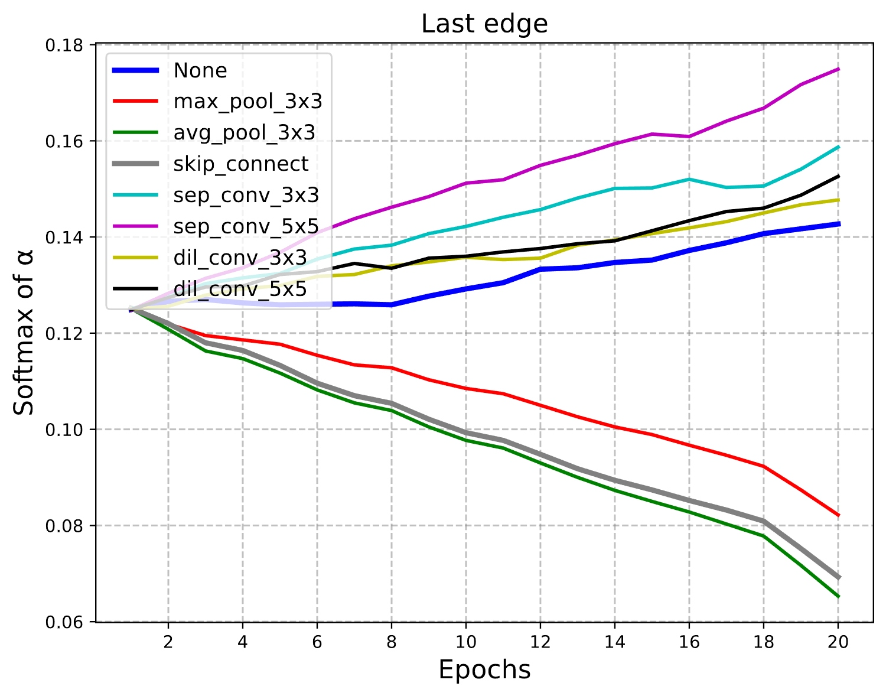

## Introduction
This repository implements an enhanced **Differentiable Architecture Search (DARTS)** algorithm integrated with the **SynFlow** metric. The proposed method is designed to **generate a reasonable neural network architecture in real time** for downstream tasks.

The search space is composed of multiple **domain-general architectural modules**, enabling the discovered architectures to be applied across **computer vision, audio, and natural language processing** tasks.

## Key Features

- **SynFlow-Integrated DARTS**
  - Incorporates the SynFlow indicator to improve search stability and architecture evaluation.
  - Helps mitigate performance collapse commonly observed in standard DARTS.

- **Domain-General Search Space**
  - Built from reusable and general-purpose network modules.
  - Supports multiple domains including:
    - Computer Vision (CV)
    - Audio
    - Natural Language Processing (NLP)

- **Real-Time Architecture Generation**
  - Dynamically produces a task-appropriate neural architecture during the search process.
  - Reduces the need for manual architecture design.

- **State-of-the-Art Performance**
  - Although most DARTS-based methods are benchmarked primarily in the CV domain, this project focuses on standard **CV benchmarks** for evaluation.
  - Achieves **state-of-the-art (SOTA)** results.

## Motivation

Most existing DARTS variants are evaluated exclusively on computer vision tasks, which limits their generalization to other domains. By introducing SynFlow as a principled guiding signal and designing a unified, modular search space, this project aims to improve both **search robustness** and **cross-domain applicability**.

## Benchmarks and Results

- Evaluated mainly on widely used **computer vision benchmarks**
- Outperforms existing DARTS-based methods
- Demonstrates improved architecture quality and search stability
## Searched Architectures on CIFAR-10

Below we visualize the architectures searched on **CIFAR-10**, including the **Normal Cell** and **Reduction Cell**.

### Normal Cell

  

*The normal cell searched on CIFAR-10. It preserves the spatial resolution and is responsible for feature extraction.*

### Reduction Cell

  

*The reduction cell searched on CIFAR-10. It reduces the spatial resolution while increasing the number of channels.*

## Architecture Parameter Dynamics

To analyze the optimization behavior during the search process, we compare the evolution of architecture parameters between the **original DARTS method** and **our Zen-DARTS method**.

### Original Method

  

*Architecture parameter evolution of the original method. Operations without learnable parameters (e.g., skip connections or none operations) exhibit an early optimization advantage, which may bias the search.*

### Zen-DARTS (Ours)

  

*Architecture parameter evolution of our method. By integrating the SynFlow metric, the early dominance of parameter-free operations is effectively eliminated, leading to a more balanced and stable architecture search.*

## Applications

The architectures discovered by SynFlow-DARTS can be directly applied to:

- Image classification and recognition
- Audio classification and speech-related tasks
- Natural language understanding and modeling

## Project Goal

The primary goal of this project is to provide a **robust and efficient neural architecture search framework** that can automatically generate high-quality network architectures for diverse downstream tasks.
